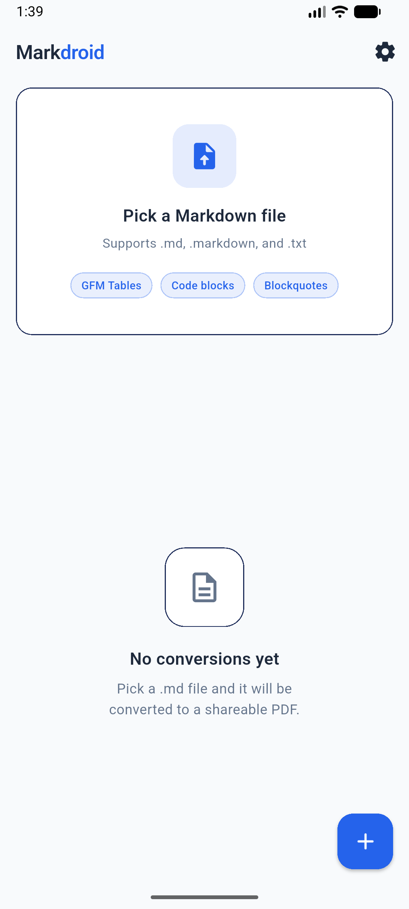
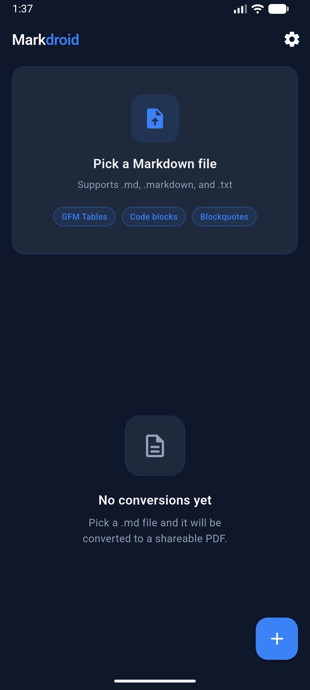

# markdroid

[](https://opensource.org/licenses/MIT)


Android app to convert Markdown files to PDF. Built with Flutter.

|                  Light Mode                  |                  Dark Mode                  |
| :------------------------------------------: | :-----------------------------------------: |
|     |      |

## Features

- Pick `.md`, `.markdown`, or `.txt` files from device storage
- Live preview (rendered + raw source) before converting
- GitHub Flavored Markdown — tables, code blocks, blockquotes, strikethrough
- Clean styled PDF output (A4)
- Share PDF via system share sheet
- Save to Downloads folder
- Open PDF in external viewer
- Conversion history with delete support

## Stack

| Layer | Package |
|---|---|
| Markdown parsing | `markdown` ^7.2.2 |
| Markdown preview | `flutter_markdown` ^0.7.3 |
| PDF generation | `pdf` + `printing` ^5.13.1 |
| File picking | `file_picker` ^8.1.2 |
| Share sheet | `share_plus` ^10.0.2 |
| Open external | `open_file` ^3.3.2 |

## Setup

### 1. Prerequisites

```bash
flutter --version   # needs Flutter 3.10+
```

### 2. Install dependencies

```bash
flutter pub get
```

### 3. Run on device / emulator

```bash
flutter run
```

### 4. Build release APK

```bash
flutter build apk --release
# Output: build/app/outputs/flutter-apk/app-release.apk
```

### 5. Build app bundle (Play Store)

```bash
flutter build appbundle --release
```

## Project Structure

```
lib/
  main.dart                  # App entry point
  theme/
    app_theme.dart           # Colors, typography, component themes
  services/
    pdf_service.dart         # Markdown → HTML → PDF pipeline
    file_service.dart        # File picking & reading
  screens/
    home_screen.dart         # Main screen with conversion card + history
    preview_screen.dart      # Rendered preview + source tabs
  widgets/
    conversion_card.dart     # Pick file CTA card
    history_tile.dart        # Individual PDF history item
    empty_state.dart         # No conversions yet state
android/
  app/src/main/
    AndroidManifest.xml      # Permissions + FileProvider + intent filters
    res/xml/file_paths.xml   # FileProvider paths config
```

## How the conversion works

```
.md file
  └─> dart:io File.readAsString()
        └─> markdown package: markdownToHtml()  [GFM extensionSet]
              └─> HTML string with embedded CSS
                    └─> Printing.convertHtml()  [WebView/Chromium renderer]
                          └─> Uint8List PDF bytes
                                └─> File.writeAsBytes() → .pdf on disk
```

## Permissions (Android)

- `READ_EXTERNAL_STORAGE` — pick files (up to Android 12)
- `READ_MEDIA_DOCUMENTS` — pick files (Android 13+)
- `WRITE_EXTERNAL_STORAGE` — save to Downloads (up to Android 9)

For Android 13+ the app uses `MediaStore` / scoped storage via the `printing` package and `file_picker` internally — no runtime permission needed for picking.

## Notes

- `Printing.convertHtml()` uses an embedded WebView renderer on Android, so complex markdown (tables, nested lists, syntax highlighting) renders accurately.
- PDFs are saved to `getApplicationDocumentsDirectory()` (app-private). Use Share or Save to Downloads to export.
- The app can also receive `.md` files shared from other apps (file manager, cloud storage, etc.) via the `VIEW` intent filter.

This repository is licensed under the **MIT License**. See the [LICENSE](LICENSE) file for more details.
